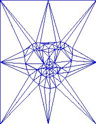

# FaceMorpher
Face Morphing using Delaunay Triangulation

I use a neural network to detect features on the faces taken as inputs. 

With the features I can use a Delaunay Triangulation to get this : 

Then I interpolate between the two set of points to get an intermediate set of points which I also Triangulate 

For each triangle in the interpolated image I use an affine transform to find where it lands in the source and target images ( obama and hilary here) and I blend the 2 colors depending on the interpolation coefficient. 

Then I generate multiple interpolated images with an increasing coefficient to get an animation. 

